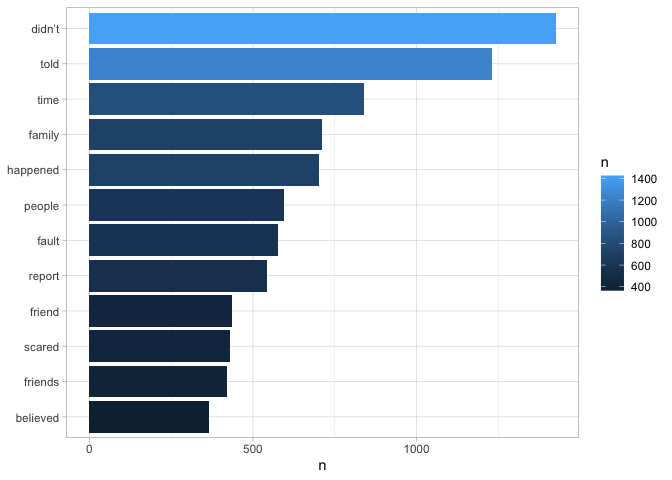
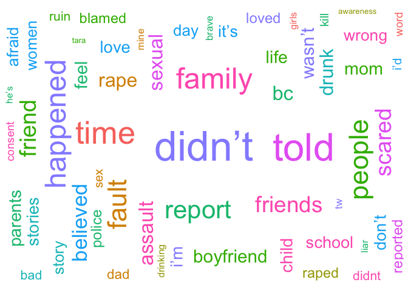
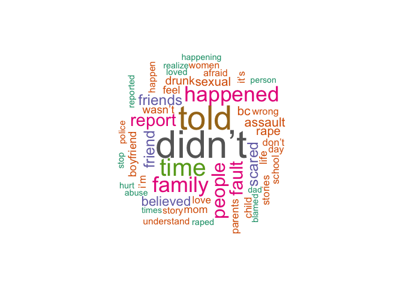

WhyIDidntReport, April 2020
===========================
================

Overview
--------

A little over a year ago, I [analyzed tweets](https://github.com/deepssquared/whyididntreport) using the hashtag **\#WhyIDidntReport**. This hashtag first trended in Fall 2018, during the nomination of Supreme Court Justice Brett Kavanuagh. It gained momentum from prominent public figures. This hashtag recently re-surfaced in response to allegations against the presumptive Democratic presidential nominee, Joe Biden. I'll be updating this file as more tweets roll in and to map out more sophisticated analyses.

Text Mining
-----------

I collected a total of **8533 tweets**, filtering for accounts with few followers and excluding retweets. The tweets were dated between **4/2/2020** and **4/9/2020**. Based on the words and excluding common words (e.g. "a", "the", "I", "me"), the following words had the highest frequency:

Here's the same visualization in two word clouds:

Sentiment Analysis
------------------

Using some pre-made tables, courtesy of the tidytext package, we can also map some of the immediate emotions coded by the top frequent words:

